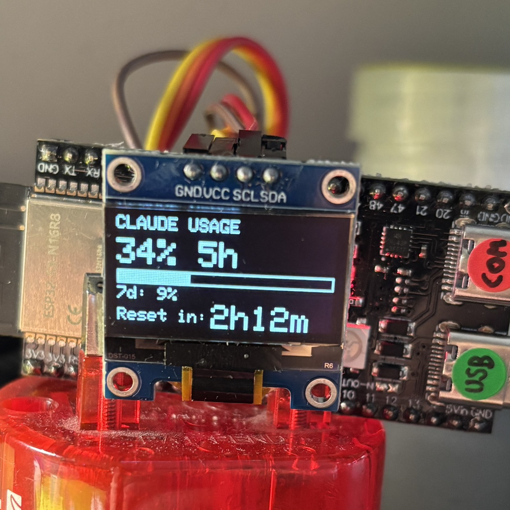

# Claude Usage Dashboard — ESP32-S3

A physical dashboard that displays your Claude.ai usage limits on a 128×64 OLED screen. Shows the current 5-hour session usage, 7-day cap, and live countdown to reset — updated automatically. No API key required.

---

## Hardware

| Component | Notes |
|---|---|
| ESP32-S3-N16R8 (or any ESP32-S3) | 16 MB flash, 8 MB PSRAM |
| SSD1306 OLED 128×64 I2C | 0.96" or 1.3" both work |
| USB-C cable | For flashing and power |

---

## Wiring

```
OLED         ESP32-S3
────         ────────
VCC    →     3.3V
GND    →     GND
SDA    →     GPIO 8
SCL    →     GPIO 9
```

> **Note:** GPIO 22 does not exist on ESP32-S3. Use GPIO 8/9 for I2C.

---

## Using a Different Board

The project compiles for any ESP32-family board. Only two files need to change.

### 1. `platformio.ini` — change the board

Replace the `board` line and adjust `build_flags` to match your module:

| Board | `board =` value | Remove from `build_flags` |
|---|---|---|
| ESP32 classic (Wemos D1 Mini32, NodeMCU-32S, etc.) | `esp32dev` | `-DBOARD_HAS_PSRAM` `-DARDUINO_USB_CDC_ON_BOOT=1` |
| ESP32-S3 (no PSRAM variant) | `esp32-s3-devkitc-1` | `-DBOARD_HAS_PSRAM` |
| ESP32-S2 | `esp32-s2-saola-1` | `-DBOARD_HAS_PSRAM` |
| ESP32-C3 | `esp32-c3-devkitm-1` | `-DBOARD_HAS_PSRAM` `-DARDUINO_USB_CDC_ON_BOOT=1` |
| ESP32-C6 | `esp32-c6-devkitc-1` | `-DBOARD_HAS_PSRAM` `-DARDUINO_USB_CDC_ON_BOOT=1` |

- `-DBOARD_HAS_PSRAM` — only needed if your module physically has PSRAM (look for the **R** in the part number, e.g. N16**R**8)
- `-DARDUINO_USB_CDC_ON_BOOT=1` — only needed for boards using the native USB-CDC port for Serial (ESP32-S3 and S2 dev boards)

### 2. `src/config/config.h` — change the I2C pins

```cpp
#define PIN_SDA  8   // ← change to match your wiring
#define PIN_SCL  9   // ← change to match your wiring
```

Common I2C defaults by board family:

| Board family | Default SDA | Default SCL |
|---|---|---|
| ESP32 classic | GPIO 21 | GPIO 22 |
| ESP32-S3 / S2 | GPIO 8 | GPIO 9 |
| ESP32-C3 | GPIO 8 | GPIO 9 |
| ESP32-C6 | GPIO 6 | GPIO 7 |

> Any free GPIO works for I2C. The table above lists common defaults, but you can wire SDA/SCL to any available pin — just update `config.h` to match your physical wiring.

### Can I use an ESP8266?

Not without significant rewriting. The codebase depends on three ESP32-specific libraries with no drop-in equivalent on ESP8266:

- **`WiFiClientSecure`** — the ESP8266 version has a different API and limited TLS cipher support that often fails against Cloudflare
- **`Preferences`** — uses ESP32 NVS (non-volatile storage); ESP8266 has no equivalent and would need LittleFS or EEPROM
- **Simultaneous AP+STA mode** — `WIFI_AP_STA` behaves differently on ESP8266

### Can I use a non-ESP microcontroller (Arduino Uno, STM32, etc.)?

This project requires:

1. **WiFi with HTTPS / TLS** — to call `claude.ai` directly from the device
2. **~50 KB free RAM** — for the TLS stack, JSON parser, and HTTP response buffers
3. **Arduino framework** — PlatformIO + the libraries used here

Standard Arduinos (Uno, Nano, Mega) have no WiFi and cannot run this project. Boards like the Arduino Uno R4 WiFi or RP2040 W are possible in principle, but would require porting `WiFiClientSecure`, `Preferences`, and the WiFi AP logic to their platform equivalents — a non-trivial effort.

**The easiest swap is any other ESP32-family board** — the change is two lines in two files.

---

## Software Requirements

- [VS Code](https://code.visualstudio.com/) with the [PlatformIO extension](https://platformio.org/install/ide?install=vscode)
- PlatformIO downloads all library dependencies automatically on first build

---

## Build & Flash

1. Clone or download this repository
2. Open the folder in VS Code
3. PlatformIO will detect `platformio.ini` automatically
4. Click **Build** (checkmark icon) — first build downloads the toolchain (~5 min)
5. Connect the ESP32-S3 via USB
6. Click **Upload** (arrow icon)

---

## First-Time Setup

After flashing, the device starts a WiFi access point named **ESP32-Claude-Dashboard**.

### Step 1 — Get your Claude session cookie

Do this **before** connecting to the device AP, while on your normal WiFi:

1. Open [claude.ai](https://claude.ai) in Chrome and make sure you are logged in
2. Open DevTools: `F12` (or `Ctrl+Shift+I`)
3. Go to the **Network** tab
4. Refresh the page or click anything to generate a request
5. Click any request to `claude.ai` in the list
6. In the right panel, find **Request Headers** → **Cookie**
7. Copy the **entire value** of the Cookie header

```
DevTools → Network → any claude.ai request → Request Headers

Cookie: sessionKey=sk-ant-...; __cf_bm=...; other=...
        ^^^^^ copy this entire value
```

> **Why this approach?** The ESP32 impersonates a logged-in browser session. The cookie is valid as long as you stay logged in to claude.ai. If you log out or the session expires, repeat this step.

### Step 2 — Configure the device

1. Connect to WiFi **ESP32-Claude-Dashboard** (password: `dashboard1`)
2. Open a browser and go to `http://192.168.4.1`
3. Under **Connection Settings**, fill in:
   - **Home WiFi SSID** — your home router network name
   - **Home WiFi Password** — your home router password
   - **Claude Cookie Header** — paste the full cookie value from Step 1
4. Click **Save Settings**

The device connects to your home WiFi and fetches live data within ~10 seconds. The OLED updates automatically.

> After saving, the AP stays running. You can return to your home WiFi and still reach the portal at `http://192.168.4.1` while connected to the ESP32-Claude-Dashboard AP.

---

## What It Displays

| Field | Description |
|---|---|
| **Primary %** | 5-hour session usage (or 7-day if no 5h limit on your plan) |
| **Progress bar** | Visual fill for the primary metric |
| **7-day %** | Weekly usage cap |
| **7-day Opus %** | Weekly Opus model usage (Pro plan only) |
| **Reset in: 2h15m** | Live countdown to next usage reset (NTP-synced) |

All rows are individually toggleable in the web portal under **Display Settings**.

---

## Web Portal

Connect to the ESP32-Claude-Dashboard AP and open `http://192.168.4.1`.

| Section | Description |
|---|---|
| **Live Preview** | Canvas rendering of the current OLED layout, updates every 30 s |
| **Display Settings** | Toggle each row on/off |
| **Connection Settings** | WiFi credentials, session cookie, refresh interval, AP password |
| **Refresh Data** | Force an immediate fetch |
| **Reset Defaults** | Wipe all settings back to factory defaults |

---

## Settings Reference

| Setting | Default | Description |
|---|---|---|
| Refresh interval | 30 000 ms | How often to poll claude.ai |
| AP password | `dashboard1` | Password for the device WiFi AP |
| Session cookie | *(empty)* | Full Cookie header from claude.ai DevTools |
| Home WiFi SSID | *(empty)* | Your home router — required for internet access |

---

## Troubleshooting

**OLED shows nothing**
- Check wiring: SDA → GPIO 8, SCL → GPIO 9, VCC → 3.3V (not 5V)
- Verify the I2C address is `0x3C`; some modules use `0x3D` — edit `config.h` if needed

**Build fails with `cc1plus.exe: CreateProcess: No such file or directory`**
- The toolchain download was corrupted. Run in PowerShell:
  ```powershell
  Remove-Item -Recurse -Force "$env:USERPROFILE\.platformio\packages\toolchain-xtensa-esp-elf"
  ```
  Then rebuild — PlatformIO re-downloads it automatically.

**OLED shows `Set WiFi SSID`**
- Open the portal at `http://192.168.4.1` and enter your home WiFi credentials

**OLED shows `Set session key`**
- Follow Step 1 above and paste the cookie into the portal

**OLED shows `API Error`**
- Click **Refresh Data** in the portal and check the Org ID field populates
- The session cookie may have expired — repeat Step 1
- Open the Serial Monitor (115200 baud) in PlatformIO for detailed HTTP error codes

**OLED shows `WiFi connecting`**
- Wait 15–20 seconds after powering on; the device retries automatically
- Verify SSID and password in the portal

**Reset countdown shows HH:MM instead of Xh Ym**
- NTP sync not yet complete — resolves within ~30 seconds of WiFi connecting

---

## Architecture

```
claude.ai  ──HTTPS──>  ESP32-S3  ──I2C──>  OLED
             (session cookie)
                  |
                  └──WiFi AP──>  Browser (192.168.4.1)
```

The ESP32 calls `claude.ai/api/organizations/{org}/usage` directly using your browser session cookie. No backend server, no API key, no cloud service required. The org UUID is auto-discovered on first fetch and cached in flash storage.

---

## Security Notes

**Change the default AP password.** The device ships with AP password `dashboard1`. Anyone within WiFi range who knows the password can open the settings portal and replace your session cookie or WiFi credentials. Change it to something strong in the web portal under *Connection Settings → AP Password*.

**No TLS certificate verification.** The ESP32 connects to `claude.ai` with `setInsecure()` because loading a full CA certificate bundle requires significant flash space. In practice this means a machine-in-the-middle on your local network could intercept the session cookie in transit. On a trusted home/office network this risk is very low.

**Your credentials live on the device, never in code.** The session cookie, WiFi password, and AP password are stored only in the ESP32's NVS (encrypted flash partition) — they are never written to any source file, config file, or anywhere that would appear in this repository.

**The settings portal is HTTP, not HTTPS.** Traffic between your browser and `192.168.4.1` is unencrypted. Use the portal only while connected to the device's own AP, not over a shared network.

---

## License

MIT

---

## Screenshots

### OLED Display



### Web Portal


