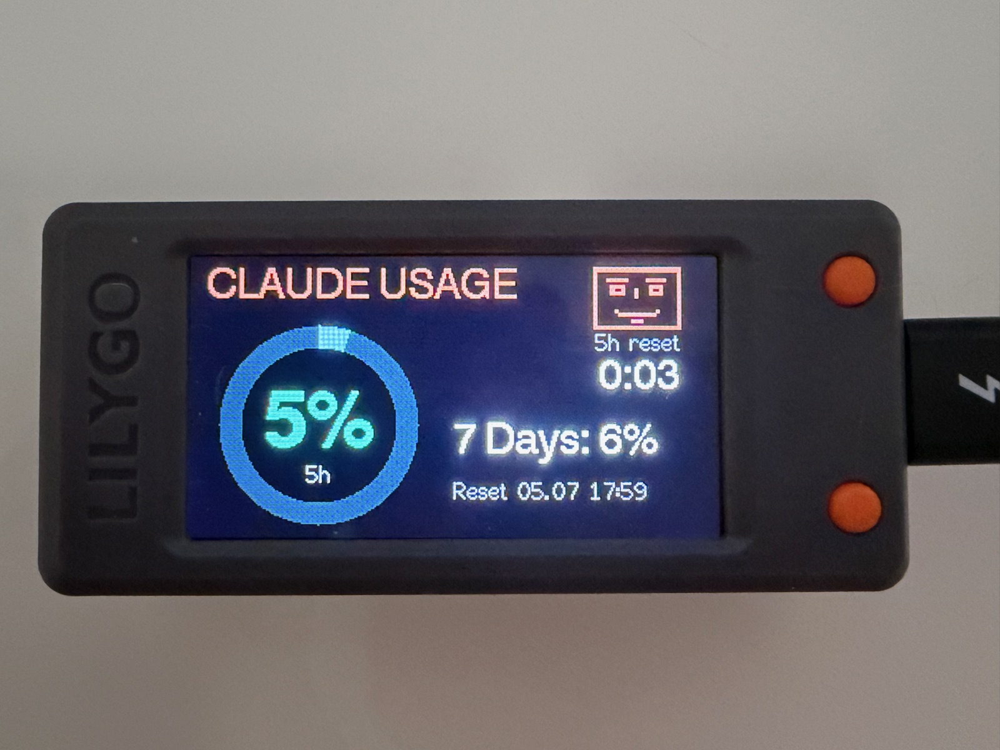
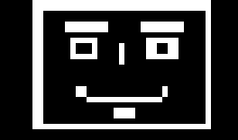
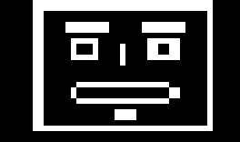
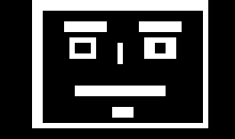
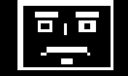
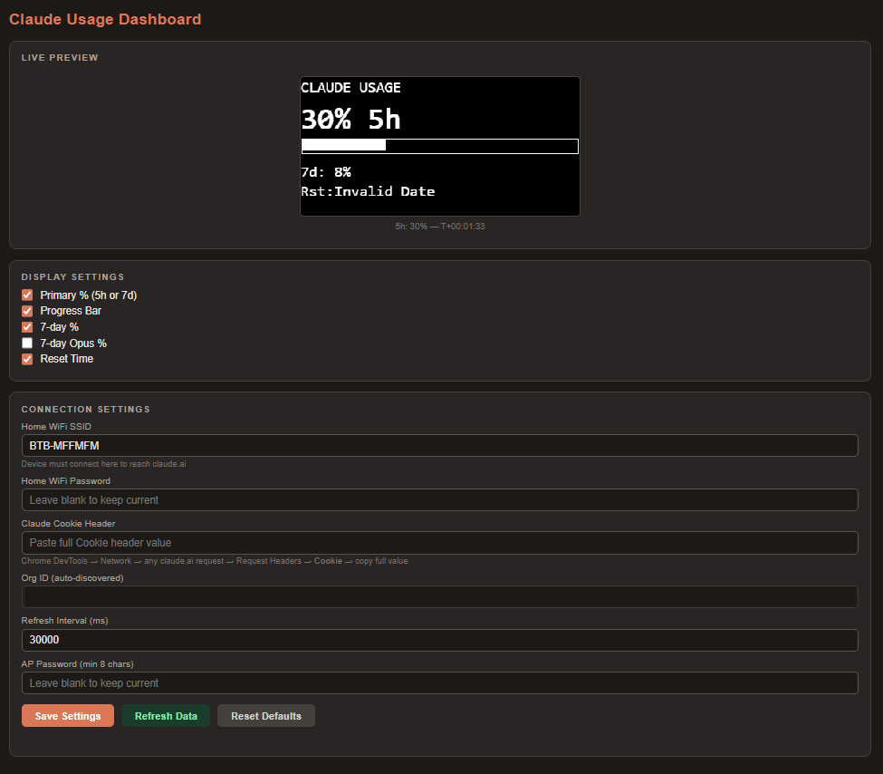

# Claude Usage Dashboard — LILYGO T-Display S3


A physical dashboard that displays your Claude.ai usage limits on the LILYGO T-Display S3 (1.9" color LCD, 320×170). Adapted from the original SSD1306 OLED version. Shows the current 5-hour session usage, 7-day cap, and live countdown to reset — updated automatically. No API key required.



---

## Hardware

| Component | Notes |
| --- | --- |
| LILYGO T-Display S3 | ESP32-S3, 16 MB flash, 8 MB OPI PSRAM, integrated 1.9" ST7789 LCD (170×320, 8-bit parallel) |
| USB-C cable | For flashing and power |

No wiring needed — the display is on-board. The LCD pin mapping (8-bit
parallel bus, D0–D7 on GPIO 39–48, WR=8, RD=9, DC=7, CS=6, RST=5, BL=38)
is configured via TFT_eSPI build flags in `platformio.ini`. GPIO 15 is
driven HIGH at boot to enable the LCD power rail (required on battery).

## Adapted for the LILYGO T-Display S3

This is a port of the original 128×64 SSD1306 OLED project to the LILYGO
T-Display S3 and its larger 1.9" color LCD. The bigger, colour panel changes
the following compared to the OLED original:

| Area | Original (SSD1306 OLED) | This port (T-Display S3) |
| --- | --- | --- |
| Display | 128×64 monochrome, I²C (`SSD1306` lib) | 320×170 colour, 8-bit parallel `ST7789` via **TFT_eSPI** |
| Wiring | 2 wires (SDA/SCL) | none — LCD is on-board, pins set through build flags |
| Layout | tight 1-bit mono rows | roomy landscape layout, larger fonts, more rows visible at once |
| Primary metric | text % + bar | **ring gauge** with the % in the centre, coloured by band (0–30 green / 31–60 yellow / 61–80 orange / 81–100 red) |
| Brightness | fixed | PWM-dimmable backlight (LEDC); **KEY** button cycles 100 → 60 → 25 → 5 % |
| Power | — | GPIO 15 drives the LCD power rail HIGH at boot (needed on battery) |
| Refresh button | — | **BOOT** button forces an immediate, cache-bypassing refresh |
| Face icon | 1-bit sprite | rendered in colour, same wink/mouth-follows-usage behaviour |

Everything else (WiFi AP+STA portal, data fetching, settings, NTP countdown)
is shared with the original. To run the firmware on a different board, see
[Using a Different Board](#using-a-different-board) below.

## Data source modes

The firmware supports two ways of getting usage data:

1. **Proxy mode (recommended):** A small Python proxy (see [`proxy/`](proxy/))
   runs on a host in your LAN (Home Assistant box, Raspberry Pi, NAS). It
   polls Anthropic's OAuth usage endpoint — the same data source as Claude
   Code's `/usage` command, covering usage from Claude Code, the apps and
   the web — handles token refresh, and serves a slim JSON. The ESP32 only
   ever talks to the proxy; no Claude credentials on the device. Works
   remotely via Tailscale Funnel (HTTPS is verified against the built-in
   ISRG Root X1 CA). Set **Usage Proxy URL** (+ optional Bearer token) in
   the portal.
2. **Legacy mode:** claude.ai session cookie, as in the original project.
   Used automatically when the proxy URL is empty.

> **Gentle polling + on-demand freshness:** the proxy caches upstream data (default
> 10 min) so routine polling stays well clear of the rate limit. The **BOOT button**
> triggers a cache-bypassing `?force=1` refresh when you want the latest numbers now.

## Status retrieval via a Home Assistant proxy

If you already run Home Assistant, its host is the ideal place for the usage
proxy — it is always on, on your LAN, and can expose the numbers to HA at the
same time.

> 📖 **Full step-by-step guide:** [docs/home-assistant.md](docs/home-assistant.md)
> — installing Tailscale in Home Assistant, exposing the proxy to the T-Display
> via Tailscale Funnel, running the proxy (Docker or a local HA add-on), and the
> REST sensor. The quick summary below is the short version.

**1. Run the proxy on the HA host.** Deploy [`proxy/`](proxy/) next to Home
Assistant (Docker/compose or the systemd unit — see [`proxy/README.md`](proxy/README.md)).
It polls Anthropic's OAuth usage endpoint and serves a slim JSON on port `8787`.

**2. Point the ESP32 at it.** In the device portal (`http://192.168.4.1`) set
**Usage Proxy URL** to the proxy — e.g. `http://<ha-host>:8787/usage` on the
LAN, or the `https://<node>.<tailnet>.ts.net/usage` Funnel URL for remote
access — plus the **Proxy Bearer Token** if `AUTH_TOKEN` is set. The dashboard
then pulls its status straight from the HA-hosted proxy; no cookie on the
device.

**3. (Optional) Surface the same numbers in Home Assistant.** Add a REST sensor
so the values also show up on your HA dashboards:

```yaml
rest:
  - resource: http://<ha-host>:8787/usage
    headers:
      Authorization: "Bearer <AUTH_TOKEN>"   # omit if AUTH_TOKEN is unset
    scan_interval: 180                        # 3 min — matches the proxy cache; don't go lower
    sensor:
      - name: "Claude Usage 5h"
        value_template: "{{ value_json.fiveHour.utilization }}"
        unit_of_measurement: "%"
      - name: "Claude Usage 7d"
        value_template: "{{ value_json.sevenDay.utilization }}"
        unit_of_measurement: "%"
```

The ESP32 and Home Assistant both read the same cached proxy response, so a
single upstream poll feeds both — no extra load on Anthropic's endpoint.

## Buttons

| Button | GPIO | Function |
| --- | --- | --- |
| BOOT (left of USB) | 0 | Force an immediate refresh — in proxy mode this **bypasses the proxy cache** (`?force=1`) for the freshest numbers, with a brief "Refreshing…" on screen |
| KEY (right of USB) | 14 | Cycle backlight brightness (100 → 60 → 25 → 5 %) |

## Using a Different Board

The firmware compiles for any ESP32-family board, but on the T-Display S3 the
display is the board's on-board parallel ST7789 driven through TFT_eSPI build
flags. Porting to another board means reconfiguring (or replacing) the display,
not just swapping the MCU — so expect to touch `platformio.ini` in two places.

### 1. `platformio.ini` — change the board

Replace the `board` line and adjust `build_flags` to match your module:

| Board | `board =` value | Remove from `build_flags` |
|---|---|---|
| ESP32 classic (Wemos D1 Mini32, NodeMCU-32S, etc.) | `esp32dev` | `-DBOARD_HAS_PSRAM` `-DARDUINO_USB_CDC_ON_BOOT=1` |
| ESP32-S3 (no PSRAM variant) | `esp32-s3-devkitc-1` | `-DBOARD_HAS_PSRAM` |
| ESP32-S2 | `esp32-s2-saola-1` | `-DBOARD_HAS_PSRAM` |
| ESP32-C3 | `esp32-c3-devkitm-1` | `-DBOARD_HAS_PSRAM` `-DARDUINO_USB_CDC_ON_BOOT=1` |
| ESP32-C6 | `esp32-c6-devkitc-1` | `-DBOARD_HAS_PSRAM` `-DARDUINO_USB_CDC_ON_BOOT=1` |

- `-DBOARD_HAS_PSRAM` — only needed if your module physically has PSRAM (look for the **R** in the part number, e.g. N16**R**8)
- `-DARDUINO_USB_CDC_ON_BOOT=1` — only needed for boards using the native USB-CDC port for Serial (ESP32-S3 and S2 dev boards)

### 2. `platformio.ini` — reconfigure the display

The ST7789 pin mapping lives in the `-DTFT_*` build flags (the 8-bit parallel
bus D0–D7, plus WR, RD, DC, CS, RST and BL). A different board or panel needs
these changed to match its wiring and driver — see the
[TFT_eSPI](https://github.com/Bodmer/TFT_eSPI) documentation for the driver
defines. `src/config/config.h` only holds board-level pins (LCD power rail,
backlight, the two buttons) — there are **no I2C display pins** to change.

> Going back to an I2C SSD1306 OLED (as in the original project) is also
> possible, but means restoring an SSD1306 driver and rewriting `display.cpp`
> for a 1-bit framebuffer — not just a pin change.

### Can I use an ESP8266?

Not without significant rewriting. The codebase depends on three ESP32-specific libraries with no drop-in equivalent on ESP8266:

- **`WiFiClientSecure`** — the ESP8266 version has a different API and limited TLS cipher support that often fails against Cloudflare
- **`Preferences`** — uses ESP32 NVS (non-volatile storage); ESP8266 has no equivalent and would need LittleFS or EEPROM
- **Simultaneous AP+STA mode** — `WIFI_AP_STA` behaves differently on ESP8266

### Can I use a non-ESP microcontroller (Arduino Uno, STM32, etc.)?

This project requires:

1. **WiFi with HTTPS / TLS** — to call `claude.ai` directly from the device
2. **~50 KB free RAM** — for the TLS stack, JSON parser, and HTTP response buffers
3. **Arduino framework** — PlatformIO + the libraries used here

Standard Arduinos (Uno, Nano, Mega) have no WiFi and cannot run this project. Boards like the Arduino Uno R4 WiFi or RP2040 W are possible in principle, but would require porting `WiFiClientSecure`, `Preferences`, and the WiFi AP logic to their platform equivalents — a non-trivial effort.

**The easiest swap is any other ESP32-family board** — the change is two lines in two files.

---

## Software Requirements

- [VS Code](https://code.visualstudio.com/) with the [PlatformIO extension](https://platformio.org/install/ide?install=vscode)
- PlatformIO downloads all library dependencies automatically on first build

---

## Build & Flash

1. Clone or download this repository
2. Open the folder in VS Code
3. PlatformIO will detect `platformio.ini` automatically
4. Click **Build** (checkmark icon) — first build downloads the toolchain (~5 min)
5. Connect the ESP32-S3 via USB
6. Click **Upload** (arrow icon)

---

## First-Time Setup

After flashing, the device starts a WiFi access point named **ESP32-Claude-Dashboard**.

### Step 1 — Connect to the device and set your WiFi

1. Connect to WiFi **ESP32-Claude-Dashboard** (password: `dashboard1`)
2. Open a browser and go to `http://192.168.4.1`
3. Under **Connection Settings → WiFi Networks**, fill in at least one of the
   **four** slots (SSID + password). The device connects to whichever configured
   network is in range and **switches automatically** when you move — so you can
   add home, office, etc. and carry the device between them.

Now pick **one** data source in Step 2 — proxy (recommended) or the legacy cookie.

### Step 2a — Proxy mode (recommended)

Run the usage proxy on a host in your LAN — a Home Assistant box, Raspberry Pi
or NAS is ideal — and let the ESP32 poll that instead of claude.ai. Your Claude
token never leaves your LAN, there are **no credentials on the device**, and it
sidesteps the `setInsecure()` issue of the legacy path entirely (the ESP32 talks
plain HTTP to a LAN host, or HTTPS verified against the built-in ISRG Root X1
for a Tailscale Funnel URL).

1. Set up the proxy — see [`proxy/README.md`](proxy/README.md), or the
   [Status retrieval via a Home Assistant proxy](#status-retrieval-via-a-home-assistant-proxy)
   section above for the Home Assistant flow. It polls Anthropic's OAuth usage
   endpoint (same source as Claude Code's `/usage`) every ≥180 s, handles token
   refresh, and serves a slim JSON.
2. In the portal, under **Connection Settings**, fill in:
   - **Usage Proxy URL** — e.g. `http://192.168.1.10:8787/usage` (LAN) or
     `https://<node>.<tailnet>.ts.net/usage` (Tailscale Funnel)
   - **Proxy Bearer Token** — only if the proxy has `AUTH_TOKEN` set
3. Leave the **Claude Cookie Header** empty. Click **Save Settings**.

### Step 2b — Legacy cookie mode (fallback)

Use this only if you don't want to run a proxy. The ESP32 impersonates your
logged-in browser session by calling claude.ai directly. Grab the cookie
**before** connecting to the device AP, while on your normal WiFi:

1. Open [claude.ai](https://claude.ai) in Chrome and make sure you are logged in
2. Open DevTools: `F12` (or `Ctrl+Shift+I`)
3. Go to the **Network** tab
4. Refresh the page or click anything to generate a request
5. Click any request to `claude.ai` in the list
6. In the right panel, find **Request Headers** → **Cookie**
7. Copy the **entire value** of the Cookie header

```
DevTools → Network → any claude.ai request → Request Headers

Cookie: sessionKey=sk-ant-...; __cf_bm=...; other=...
        ^^^^^ copy this entire value
```

Then paste it into **Claude Cookie Header** in the portal and click **Save
Settings**, leaving the proxy URL empty.

> **Caveat:** the cookie is valid only as long as you stay logged in to
> claude.ai — if you log out or the session expires, repeat this. This path
> also uses `setInsecure()` (no TLS verification); see [Security Notes](#security-notes).

---

Whichever data source you pick, the device connects to your home WiFi and
fetches live data within ~10 seconds; the display then updates automatically.

> After saving, the AP stays running. You can return to your home WiFi and still reach the portal at `http://192.168.4.1` while connected to the ESP32-Claude-Dashboard AP.

---

## What It Displays

| Field | Description |
|---|---|
| **Ring gauge** | Blue circular gauge for the primary metric (5-hour session, or 7-day if no 5h limit on your plan), with the percentage in the centre — coloured by band: **0–30 green / 31–60 yellow / 61–80 orange / 81–100 red** |
| **5h reset countdown** | `H:MM` until the next 5-hour reset, under the face icon (NTP-synced) |
| **7 Days: N%** | Weekly usage cap |
| **Reset DD.MM. HH:MM** | Absolute date/time of the next 7-day reset, in local time (DST-aware) |
| **Face icon** | Animated face in the top-right corner that reacts to your usage |

Rows are toggleable in the web portal under **Display Settings**.

### The Face

A small animated face lives in the top-right corner (see the orange face in the photo above). It **winks every 7 seconds** (left eye, then right, then they reopen in the same order), and its **mouth follows your usage** — same metric as the primary %:

| < 30% | 30–60% | 60–80% | > 80% |
|:---:|:---:|:---:|:---:|
|  |  |  |  |
| Smile | Open | Flat | Sad |

If the face looks sad, you're about to hit your cap.

---

## Web Portal

Connect to the ESP32-Claude-Dashboard AP and open `http://192.168.4.1`.

| Section | Description |
|---|---|
| **Live Preview** | Canvas rendering of the current LCD layout, updates every 30 s |
| **Display Settings** | Toggle each row on/off |
| **Connection Settings** | WiFi credentials, usage proxy URL + token, session cookie (legacy), refresh interval, AP password |
| **Refresh Data** | Force an immediate fetch |
| **Reset Defaults** | Wipe all settings back to factory defaults |

> `GET /api/status` returns the current usage as JSON (the same data the display and Live Preview render).

---

## Settings Reference

| Setting | Default | Description |
|---|---|---|
| Usage Proxy URL | *(empty)* | Proxy endpoint; when set, the device uses proxy mode instead of the cookie |
| Proxy Bearer Token | *(empty)* | Optional `AUTH_TOKEN` for the proxy |
| Refresh interval | 30 000 ms | How often the device polls its data source (in proxy mode this reads the proxy cache; the BOOT button forces a fresh fetch) |
| AP password | `dashboard1` | Password for the device WiFi AP |
| Session cookie | *(empty)* | Legacy mode: full Cookie header from claude.ai DevTools |
| WiFi Networks (×4) | *(empty)* | Up to four SSID/password pairs — the device connects to the strongest in range and auto-switches when moved |

---

## Troubleshooting

**Display shows nothing**
- The LCD is on-board — no wiring. Make sure the board is powered via USB-C
- On battery, the LCD power rail needs `PIN_LCD_POWER` (GPIO 15) HIGH — this is
  set at boot in firmware; a very old TFT_eSPI/board definition can miss it
- If the backlight is off, cycle brightness with the **KEY** button (GPIO 14)

**Build fails with `cc1plus.exe: CreateProcess: No such file or directory`**
- The toolchain download was corrupted. Run in PowerShell:
  ```powershell
  Remove-Item -Recurse -Force "$env:USERPROFILE\.platformio\packages\toolchain-xtensa-esp-elf"
  ```
  Then rebuild — PlatformIO re-downloads it automatically.

**Display shows `Set WiFi SSID`**
- Open the portal at `http://192.168.4.1` and enter your home WiFi credentials

**Display shows `Set session key`** (legacy mode only)
- Either paste a cookie (Step 2b) or, preferably, set a **Usage Proxy URL** (Step 2a)

**Display shows `Proxy Error`** (proxy mode)
- Check the proxy is reachable: `curl http://<proxy-host>:8787/health` from your LAN
- If the URL is `https://…ts.net`, wait ~15–30 s after boot — cert verification needs NTP time first
- Verify the **Proxy Bearer Token** matches the proxy's `AUTH_TOKEN`
- Open the Serial Monitor (115200 baud) in PlatformIO for the HTTP status code

**Display shows `API Error`** (legacy mode)
- Click **Refresh Data** in the portal and check the Org ID field populates
- The session cookie may have expired — repeat Step 2b
- Open the Serial Monitor (115200 baud) in PlatformIO for detailed HTTP error codes

**Display shows `WiFi connecting`**
- Wait 15–20 seconds after powering on; the device retries automatically
- Verify SSID and password in the portal

**Reset countdown shows HH:MM instead of Xh Ym**
- NTP sync not yet complete — resolves within ~30 seconds of WiFi connecting

---

## Architecture

```
Proxy mode (recommended):
  api.anthropic.com/oauth/usage ──> Proxy (LAN/HA host) ──HTTP(S)──> ESP32-S3 ──> LCD
                          (token stays on the proxy)         (no credentials on device)

Legacy mode:
  claude.ai ──HTTPS (session cookie, setInsecure)──> ESP32-S3 ──> LCD

                                      ESP32-S3 ──WiFi AP──> Browser (192.168.4.1)
```

- **Proxy mode:** the ESP32 only ever talks to your local/Tailscale proxy, which
  polls Anthropic's OAuth usage endpoint (the same source as Claude Code's
  `/usage`) and holds the credentials. No Claude token on the device; HTTPS proxy
  URLs are verified against the built-in ISRG Root X1.
- **Legacy mode:** the ESP32 calls `claude.ai/api/organizations/{org}/usage`
  directly with your browser session cookie (via `setInsecure()`). The org UUID is
  auto-discovered on first fetch and cached in flash storage.

Either way there is no backend server, no API key, and no cloud service.

---

## Security Notes

**Change the default AP password.** The device ships with AP password `dashboard1`. Anyone within WiFi range who knows the password can open the settings portal and replace your session cookie or WiFi credentials. Change it to something strong in the web portal under *Connection Settings → AP Password*.

**No TLS certificate verification — legacy mode only.** In legacy cookie mode the ESP32 connects to `claude.ai` with `setInsecure()` (loading a full CA bundle would cost significant flash), so a machine-in-the-middle on your local network could in principle intercept the session cookie. **Proxy mode eliminates this:** an `http://` LAN proxy carries no Claude credentials at all, and an `https://` proxy URL (e.g. Tailscale Funnel) *is* verified against the built-in ISRG Root X1 — no `setInsecure()`.

**Your credentials live on the device only in legacy mode.** In proxy mode the Claude token never leaves the proxy host — the device holds at most an optional proxy Bearer token. Any secrets (session cookie, WiFi password, AP password, proxy token) are stored only in the ESP32's NVS (encrypted flash partition) — never in any source or config file in this repository.

**The settings portal is HTTP, not HTTPS.** Traffic between your browser and `192.168.4.1` is unencrypted. Use the portal only while connected to the device's own AP, not over a shared network.

---

## License

MIT

---

## Screenshots

### Web Portal


The device itself is shown at the [top of this README](#claude-usage-dashboard--lilygo-t-display-s3).


